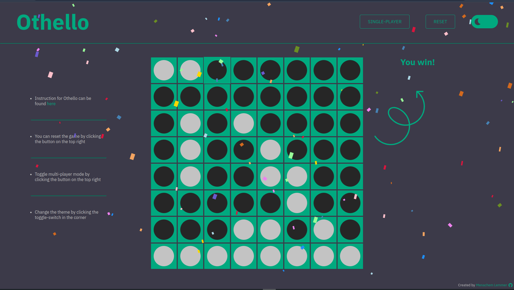

# Othello

This is a browser-based othello game that I made for General Assembly project 1. It includes single-player and multi-player modes, as well as light and dark themes. I hope you enjoy!

### Screenshots

### Getting started

- The deployed game can be found [here](https://menachemlemmer.github.io/othello/).

* The game contains a link to the game instructions.

* The wireframe for this project can be found [here](https://excalidraw.com/#json=6D-CyMi9oOFk4ZpBG-sUP,K5dcx7fL2URKkTVyOaC__A).

### Attributions

The falling confetti animation is from [CSS Script](https://www.cssscript.com/confetti-falling-animation/) and was created by **mathusummut**.

### Technologies Used

- HTML
- CSS
- JavaScript

### Next Steps

The AI I used for the single-player mode is quite simple. Going forward for this project I would like to check out some new algorithms and optimize the AI.
